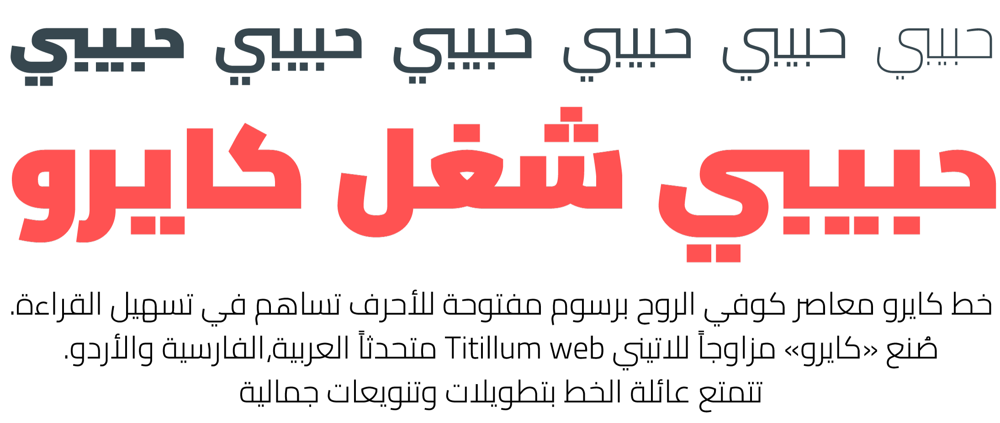

# Cairo

Cairo is a contemporary Arabic and Latin typeface family. 
[Mohamed](https://gaber.design/) [Gaber](https://www.instagram.com/gue3bara/) extended the famous Latin typeface family [Titillum Web](https://www.google.com/fonts/specimen/Titillium+Web) to support the Arabic script, with a design that is based on the Kufi calligraphic style. 

Cairo balances classic and contemporary tastes with wide open counters and short ascenders and descenders that minimize length while maintaining easy readability. 
The lighter weights can be used for body text while the heavier weights are perfect for headlines and display typography. 
Each font includes stylistic ligatures and the Arabic component has a wide glyph set that supports the Arabic, Farsi and Urdu languages.

Note that the font family in a recent versions I used connecting components, font must be generated by Glyphs.

The Cairo project is led by [Mohamed](https://gaber.design/) [Gaber](https://www.instagram.com/gue3bara/), a type designer based in Cairo, Egypt. 
To contribute, see [github.com/Gue3bara/Cairo](https://github.com/Gue3bara/Cairo)
