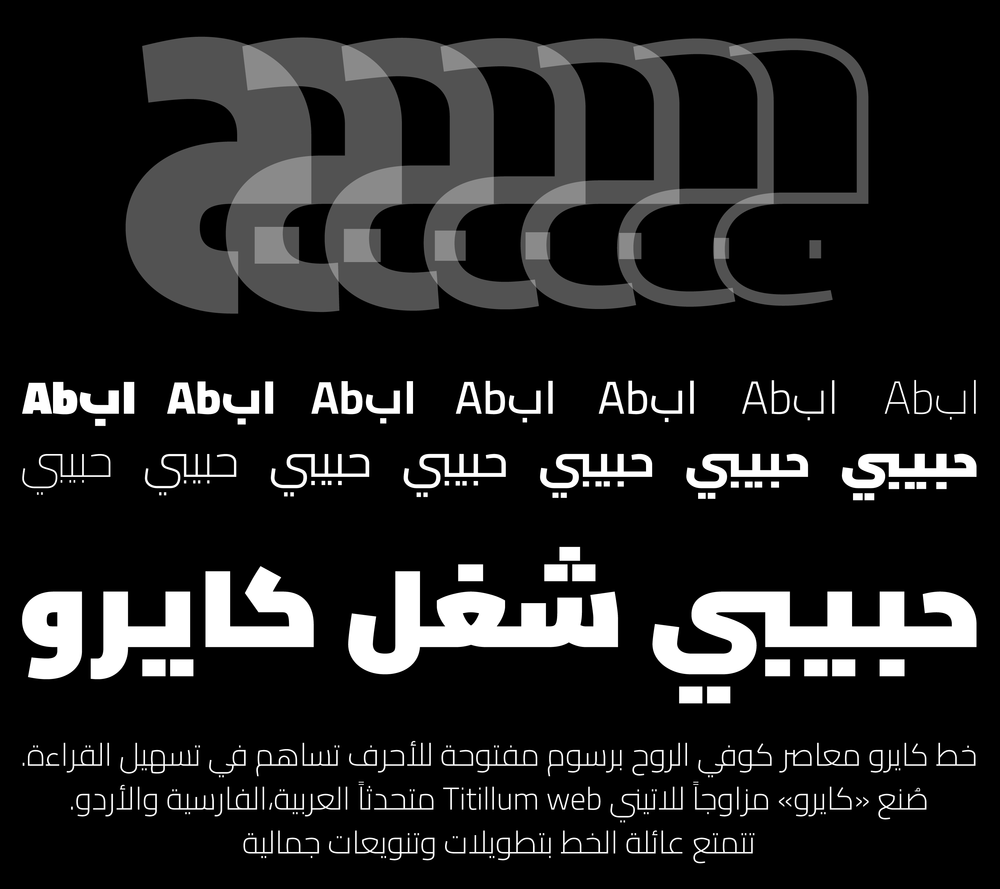

# Cairo

Cairo is a contemporary Arabic and Latin typeface family. 
[Mohamed](https://gaber.design/) [Gaber](https://www.instagram.com/gue3bara/) extended the famous Latin typeface family [Titillum Web](https://www.google.com/fonts/specimen/Titillium+Web) to support the Arabic script, with a design that is based on the Kufi calligraphic style. 

Cairo balances classic and contemporary tastes with wide open counters and short ascenders and descenders that minimize length while maintaining easy readability. 
The lighter weights can be used for body text while the heavier weights are perfect for headlines and display typography. 
Each font includes stylistic ligatures and the Arabic component has a wide glyph set that supports the Arabic, Farsi and Urdu languages.

Cairo also comes in two variants, the usual monochrome variants as well as a color variant <b>"Cairo-PLAY"</b>. The color variants are [color fonts][1] where the colors are defined by the font itself. Support for color font is currently limited to few applications like Google Chrome (version 98 or later) and [FontGoggles][2] (version 1.4.0 or later).

[1]: https://developer.chrome.com/blog/colrv1-fonts/
[2]: https://fontgoggles.org/

Note that the font family in a recent versions I used connecting components, font must be generated by Glyphs.

The Cairo project is led by [Mohamed](https://gaber.design/) [Gaber](https://www.instagram.com/gue3bara/), a type designer based in Cairo, Egypt. 
To contribute, see [github.com/Gue3bara/Cairo](https://github.com/Gue3bara/Cairo)

## Building

Fonts are built automatically by GitHub Actions - take a look in the "Actions" tab for the latest build.

If you particularly want to build fonts manually on your own computer, you will need to install the [`yq` utility](https://github.com/mikefarah/yq). On OS X with Homebrew, type `brew install yq`; on Linux, try `snap install yq`; if all else fails, try the instructions on the linked page.

Then:

* `make build` will produce font files.
* `make test` will run [FontBakery](https://github.com/googlefonts/fontbakery)'s quality assurance tests.
* `make proof` will generate HTML proof files.

## License

This Font Software is licensed under the SIL Open Font License, Version 1.1.
This license is copied below, and is also available with a FAQ at
http://scripts.sil.org/OFL

## Repository Layout

This font repository structure is inspired by [Unified Font Repository v0.3](https://github.com/unified-font-repository/Unified-Font-Repository), modified for the Google Fonts workflow.
